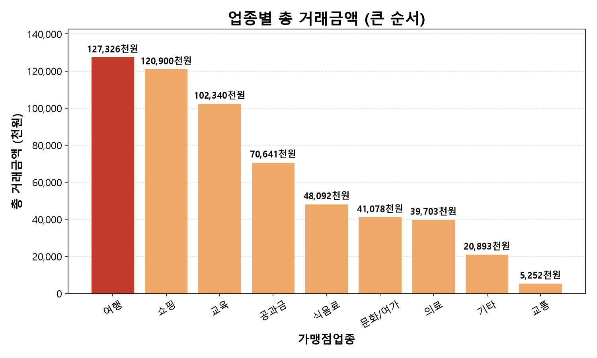
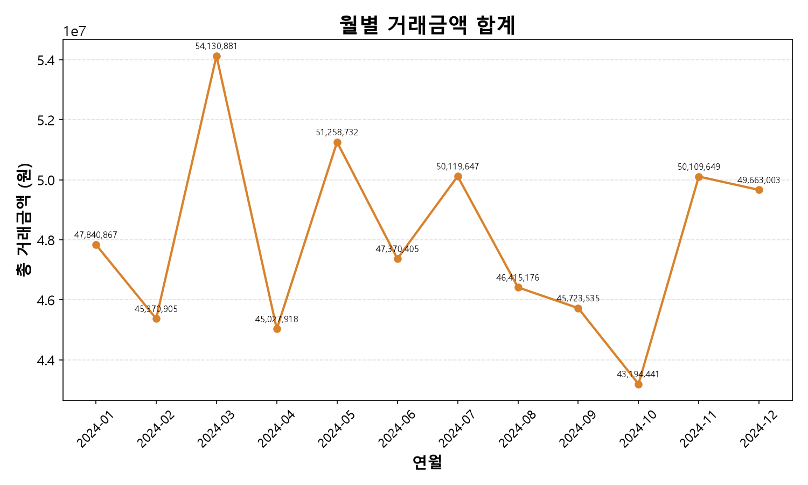
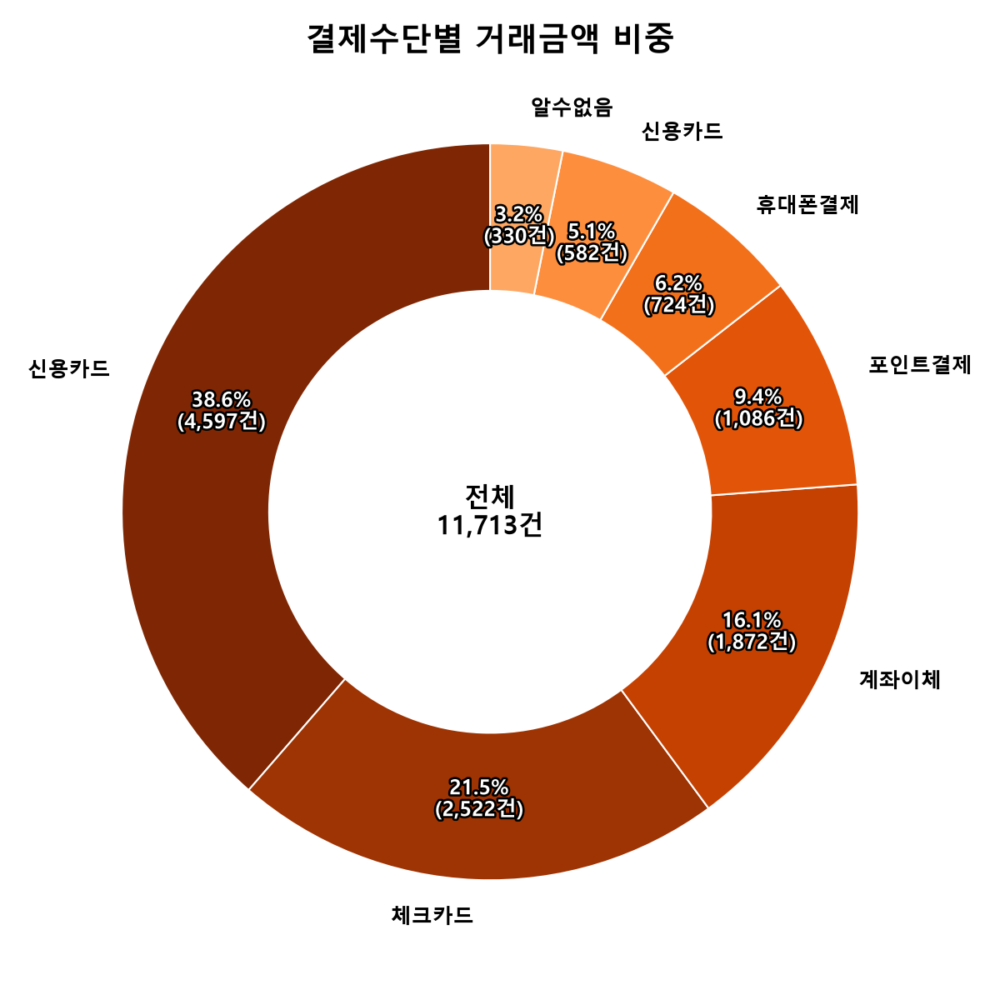
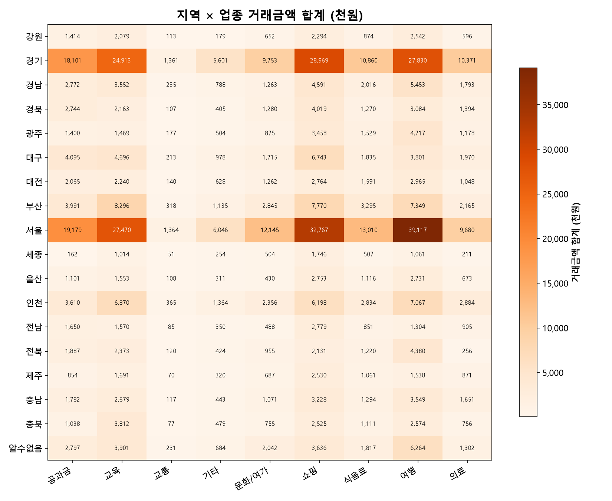
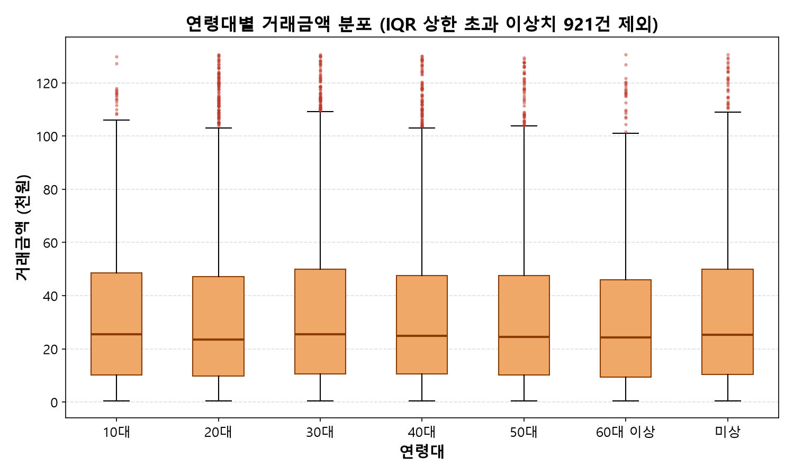
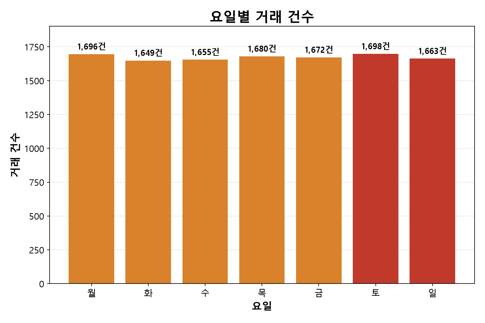

# 핀테크 결제 데이터 그래프 분석 보고서

데이터 출처: `data/핀테크_정제완료.csv` (11,713행 — 결측 채움→결측행 삭제→완전중복 제거→음수 거래금액 제거)

---

## 1. 업종별 총 거래금액

- '여행' 업종 127,325,668원으로 1위, 전체(576,225,159원)의 22.1%
- '쇼핑'(120,900,040원) 근소한 차이로 2위, 상위 두 업종이 전체의 약 43.1% — 매출 소수 업종 집중
- '교통'(5,251,924원) 최하위, 1위 대비 약 24.2배 차이 — 소액·고빈도 결제(대중교통) 특성
- **시사점**: 여행·쇼핑 등 고단가 업종 중심 제휴/프로모션이 매출 확대에 효율적, 교통은 건수 기반 서비스(포인트 적립 등) 접근 적합

---

## 2. 월별 거래금액 추이

- 3월(54,130,881원) 연중 최고치, 10월(43,194,441원) 최저치
- 최댓값·최솟값 차이 약 1,094만 원, 전체 평균(약 4,802만 원) 대비 22.8% 남짓 — 뚜렷한 계절성보다 완만한 등락
- 1~3월 상승 후 4월 급락, 5월 재상승 등 톱니형 변동 반복 — 특정 이벤트(설 연휴, 분기 결산 등)와의 연관성 추가 확인 필요
- **시사점**: 뚜렷한 성수기·비수기 구간 부재, 프로모션을 특정 시즌에 집중할 근거 미약. 월별 변동 원인(업종·이벤트) 추가 분석 필요

---

## 3. 결제수단별 거래금액 비중

- 신용카드 금액 기준 38.6%로 1위, 체크카드(21.5%)·계좌이체(16.1%) 순
- 건수 비중(39.3%)과 금액 비중(38.6%) 유사 — 신용카드 건당 단가 평균 수준
- `' 신용카드'`(공백 오염, 5.1%), `'알수없음'`(결측 대체, 3.2%) 별도 조각 존재. 공백 오염분 병합 시 신용카드 비중 약 43.8%
- **시사점**: 신용카드 의존도 최고 결제 채널 — 카드사 제휴가 매출에 직접적 영향. 공백 오염 데이터 정제 파이프라인 반영 필요(비중 정확도 개선)

---

## 4. 지역 × 업종 거래금액 히트맵

- 서울(160,777,701원)·경기(137,759,789원) 2개 지역이 전체의 약 51.8% — 수도권 매출 절반 이상 집중
- 세종(5,510,049원) 최하위, 서울 대비 약 29배 차이 — 인구·상권 규모 차이 반영
- 최대 셀은 '서울×여행'(39,116,569원), 뒤이어 '서울×쇼핑'(32,766,839원)·'경기×쇼핑'(28,969,045원) — 상위 셀 대부분 서울·경기에 집중, 업종은 여행·쇼핑 위주로 앞서 본 업종별 총액 순위와 일치
- '알수없음'(결측 대체) 지역 22,672,930원, 전체의 3.9% — 지역 집계 시 결측 비중 병기 필요
- **시사점**: 지역 마케팅 예산은 서울·경기 편중이 이미 매출 구조를 지배하므로, 신규 확대는 지방보다 수도권 내 업종 다각화(교육·공과금 등 비여행 업종 비중 확대)가 더 현실적. 지방 거점은 절대 매출보다 성장률·1인당 거래액 같은 상대 지표로 접근 필요

---

## 5. 연령대별 거래금액 분포 (박스플롯)

- 박스플롯은 IQR 상한(130,686원) 초과 이상치 921건을 그릴 때만 제외 — 정제 파일 자체는 그대로 유지
- 연령대별 중앙값 거의 동일(26,900원~28,700원 범위) — 어느 세대든 전형적인 결제 단가는 비슷함
- 평균은 10대(52,444원)·50대(52,232원)가 20~40대(46,750원~50,148원)보다 다소 높음 — 중앙값 차이가 작은데 평균이 벌어지는 건 해당 연령대에 고액 결제가 상대적으로 더 섞여 있다는 뜻
- **시사점**: 연령대별 단가 차이가 크지 않아 "특정 세대 = 고액 소비"라는 가정은 근거 약함. 오히려 거래 건수(20~30대 6,255건으로 전체의 절반 이상)가 세대별 매출 기여도를 더 크게 좌우

---

## 6. 요일별 거래 건수

- 요일별 건수 편차 크지 않음(1,649건~1,698건), 최댓값(토, 1,698건)과 최솟값(화, 1,649건) 차이 약 3%
- 평일 합계 8,352건, 주말 합계 3,361건 — 요일 수 차이(5일 vs 2일)를 감안하면 일평균은 평일 1,670건, 주말 1,681건으로 거의 동일
- **시사점**: 특정 요일에 결제가 몰리는 패턴 없음. 요일 기반 프로모션(예: '불금 할인')의 효과는 거래 건수 증가보다 다른 목적(고객 락인 등)에서 찾아야 함

---

## 종합 요약

| 그래프 | 핵심 시사점 |
|---|---|
| 업종별 총액 | 여행·쇼핑 매출 집중, 교통 소액·고빈도 |
| 월별 추이 | 3월 최고·10월 최저, 뚜렷한 계절성 부재 |
| 결제수단 비중 | 신용카드 최다(38.6%~43.8%), 데이터 정제 여지 존재 |
| 지역×업종 히트맵 | 서울·경기 51.8% 집중, 최대 셀은 서울×여행 |
| 연령대별 분포 | 세대별 결제 단가 차이 미미, 건수가 매출 기여도 좌우 |
| 요일별 건수 | 요일 편차 없음, 평일·주말 일평균 거의 동일 |

매출 집중 구조: 특정 지역(서울·경기) × 특정 업종(여행·쇼핑) × 특정 결제수단(신용카드), 시간축(월/요일) 모두 뚜렷한 쏠림 없음. 프로모션 우선순위 — 시즌/요일보다 지역·업종·결제수단 조합(예: 수도권 + 여행 업종 + 신용카드 제휴) 기준 설계 권장.
