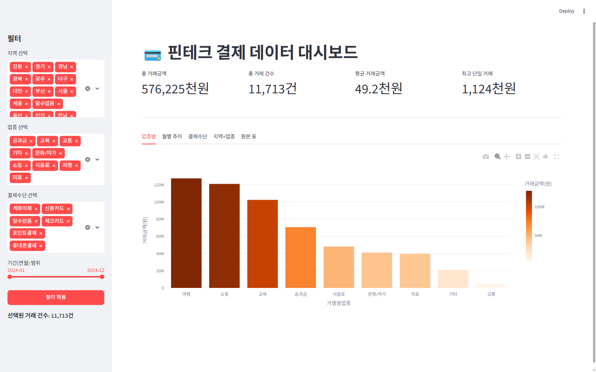
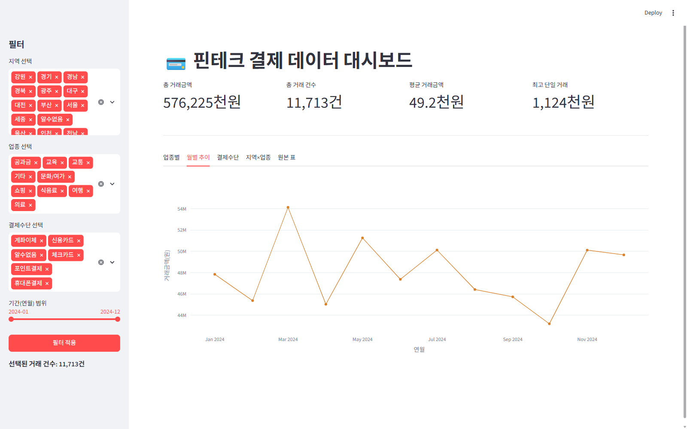
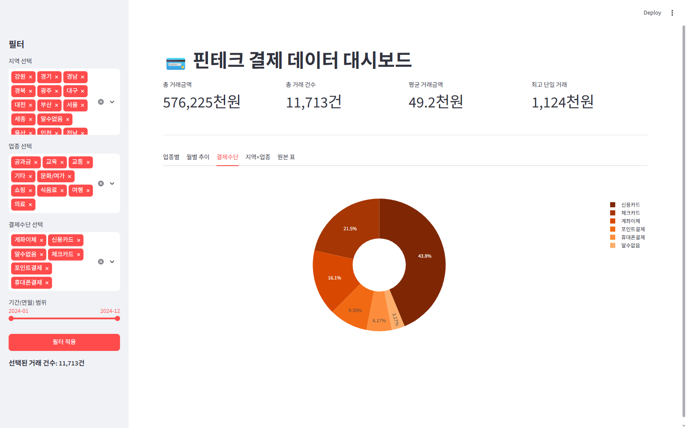
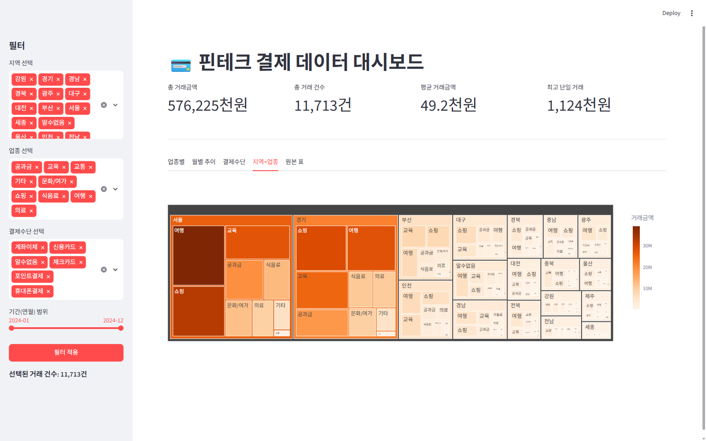
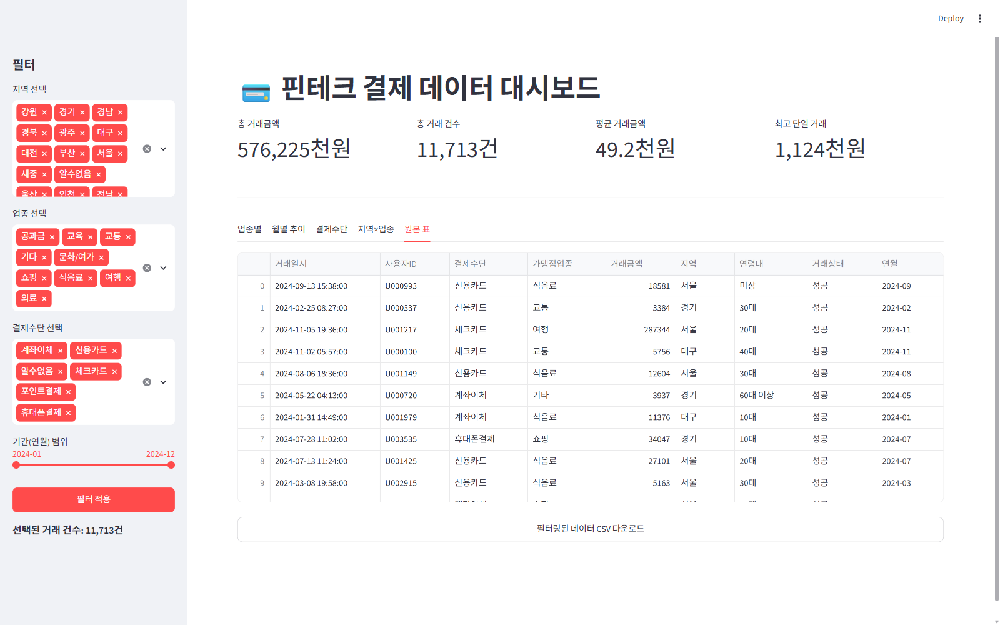
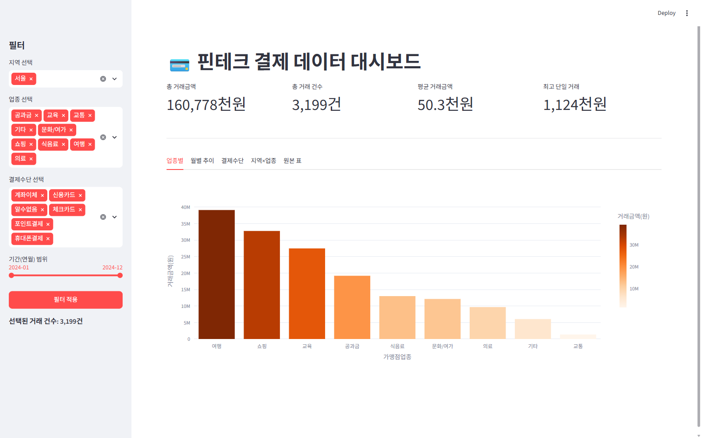

# 핀테크 결제 데이터 대시보드 — Playwright 사용자 테스트 보고서

테스트 대상: `http://localhost:8501` (`scripts/대시보드.py`)
테스트 도구: Playwright MCP 플러그인 (대기 시간 최소화하여 빠르게 진행)

---

## 1. 업종별 탭 (기본 화면)

- 전체 데이터(11,713건) 기준 업종별 막대그래프 정상 렌더링
- KPI 카드(총 거래금액 576,225천원 / 총 건수 11,713건 / 평균 49.2천원 / 최고 1,124천원) 정상 표시

## 2. 월별 추이 탭

- plotly 라인차트 정상 전환, 탭 이동 시 재계산 지연 없음

## 3. 결제수단 탭

- 도넛 차트 정상 렌더링

## 4. 지역×업종 탭

- 트리맵 정상 렌더링, 계층 구조(지역→업종) 유지

## 5. 원본 표 탭

- 표와 CSV 다운로드 버튼 정상 노출

## 6. 필터 동작 테스트 (지역 = 서울만 선택 후 적용)

- 총 거래금액 160,778천원, 건수 3,199건으로 정상 갱신
- 별도로 계산한 서울 지역 총액(160,777,701원 ≈ 160,778천원)과 일치 — **필터 로직 정확성 검증됨**
- 탭 전환 후에도 "업종별" 탭이 유지된 채로 필터만 갱신됨(탭 상태 보존 확인)

---

## 발견 사항

| 항목 | 내용 | 심각도 |
|---|---|---|
| 빈 선택 가드 정상 동작 | 지역/업종/결제수단 중 하나라도 비우고 적용하면 경고 문구가 뜨고 화면이 멈춤(의도된 동작) — 테스트 중 실수로 지역을 모두 지운 상태에서 확인됨 | 정보(문제 아님) |
| 필터 정확성 | 서울 단독 필터 결과가 사전 계산값과 정확히 일치 | 문제 없음 |
| 탭 상태 보존 | 필터 재적용 후에도 마지막으로 보던 탭이 유지됨 | 문제 없음 |

## 결론

5개 탭 전부 정상 렌더링되고, 사이드바 필터(지역 단일 선택) 적용 후 KPI·차트가 정확한 값으로 갱신되는 것을 확인했습니다. 빈 선택 시 경고 가드도 의도대로 동작합니다. 추가로 발견된 결함은 없습니다.
